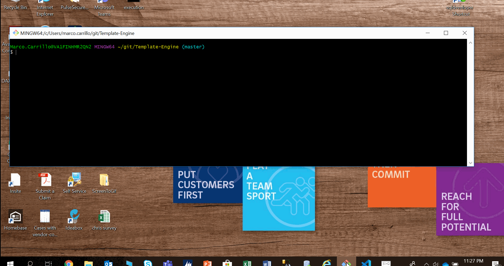
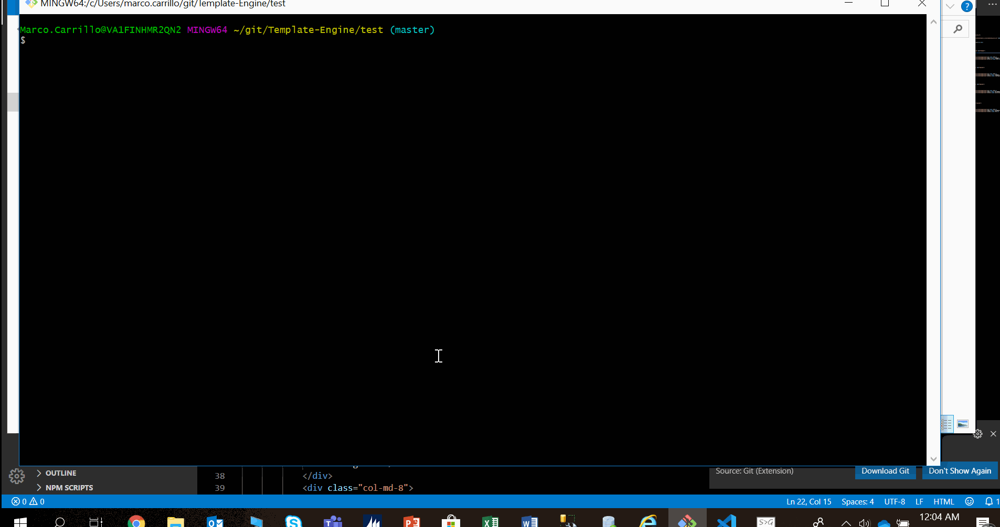

# Purpose of the application

This NodeJS CLI application ultimate goal is to generate HTML code for a team based on input from the user.

The finished page will provide a file named 'team.html' in the output directory.  When rendering this code, the intention is to display the information for each team member using the validated description from the user.

## Functionality

The application will take the user through a series of questions.

First and foremost, the application will assume (requirement) there is only one project manager.  Therefore, it will only ask how many engineers and how many interns are on the team.  The program will validate that the input is a valid number between 1 and 15.  That is, there needs to be at least one manager, one engineer and one intern in the team.  At a maximum, there could be one manager, fifteen engineers and fifteen interns.

Once the team size has been validated, the program will ask the following information

*  For the manager:  Name, ID, email address, and office number.
*  For each engineer:  Name, ID, email address, and Github name.
*  For each intern:  Name, ID, email address, and school.

The name has to be alphabetic characters only, with a length of between three and 10 Characters.

The ID has to be a number between 100 (three digits) and 99999 (five digits).

The email address has to conform to RFC 5322 guidelines.  Regular expressions obtained from www.emailregex.com, and supposedly effective 99.9% of the times.  The application won't validate the existance of the email, which means that an email name could be valid but non-existent.

The office, Github or School can be alphanumeric with a length of between three and twenty characters.  The program won't check the existance of the github or the school.

## Information returned

Information on HTML file includes the following:

*  Dilbert cartoon's character picture for each team member.  Pointy hair boss for the manager, Dilbert for the engineers, and Asok for the interns.
*  Name of the team member.
*  ID of the team member.
*  E-mail address for the team member.
*  The forth set of data will depend on the user role.  For the manager, the office number.  For the engineers their github.  For the interns their school.

There will be a card for each team member, and the application will lay them out three for each row.  The last row can contain, one, two or three cards.  Those cards will be centered for a nice visual appeal.

The order of the team members is first the manager, then the engineers and finally the interns.

##  Testing

We used unit testing coding to start the classes.  That is, first the test is developed, then the code is created to pass those tests.

